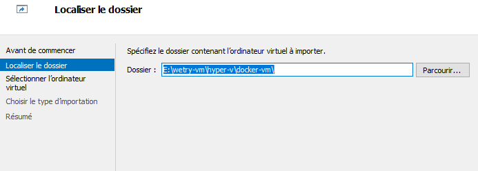

# Importer la VM

Afin d'éviter certains problèmes et de ne pas "salir" votre machine, vous aurez besoin d'une VM pour une partie du Workshop.

## Virtual Box
Si vous avez un Macos ou un Windows sans docker (et donc **sans Hyper-V**) vous pourez utilisez **Virtual Box**.
* Installez Virtual Box
* Téléchargez le fichier OVA [ici](https://afelioit-my.sharepoint.com/:u:/g/personal/d_gilson_afelio_be/EXoJSGInhQxAjs64O2HQgsUBdm44_eoD-xwTeUmBgE3tyg?e=qtegPg)
* Importez la VM
  * 
  * Choisissez le fichier OVA
  * 
  * Générez de nouvelles addresses MAC
  * 

## Hyper-V
Si vous possédez un Windows ayant déjà Hyper-V, c'est celui-ci qu'il faudra utiliser.
* Téléchargez le fichier zip [ici](https://afelioit-my.sharepoint.com/:u:/g/personal/d_gilson_afelio_be/Ef26_0Ji265NmtuosuHxw_IBcpyV9OeCMqFv8EUBRWVxgg?e=7JLgYo)
* Décompressez le zip
* Importez la VM
  * Ouvrez Hyper-V
  * 
  * Cliquez sur importer
  * 
  * Choisissez le dossier dézippé (qui contient les dossiers Snapshots, Virtual Hard Disks et Virtual Machines)
  * 
  * 
  * Choisissez le fait qu'il s'agisse d'une copie
  * 
  * Finalisez le processus
