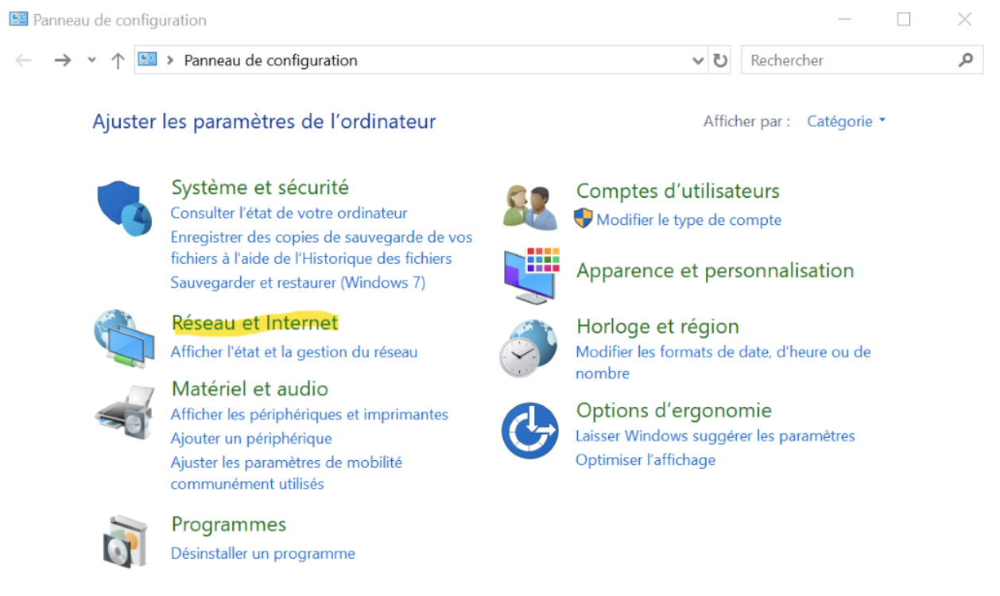

# Google DNS

Malheureusement l'outil XIP.IO que nous allons utilisé durant ce Workshop n'est pas disponible sur les serveurs DNS belges.
Nous allons donc devoir utiliser celui de google.

* [Windows](#Windows)
* [OSX](#OSX)

## Windows
Allez dans la section "réseau" du "panneau de configuration"

Centre réseau

Modifier les paramètres de la carte

Propriétés de la carte

Pripriétés IPV4

Placez les DNS de Google (8.8.8.8, 8.8.4.4)

## OSX

Allez dans les paramètres

Réseau

Paramètres avancés de la carte

DNS

Ajouter les DNS de Google (8.8.8.8, 8.8.4.4)